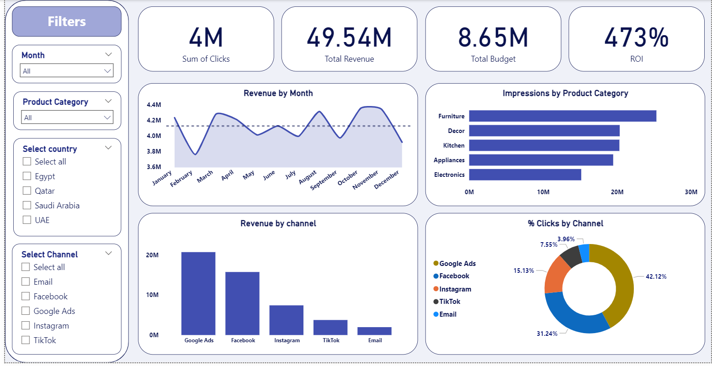
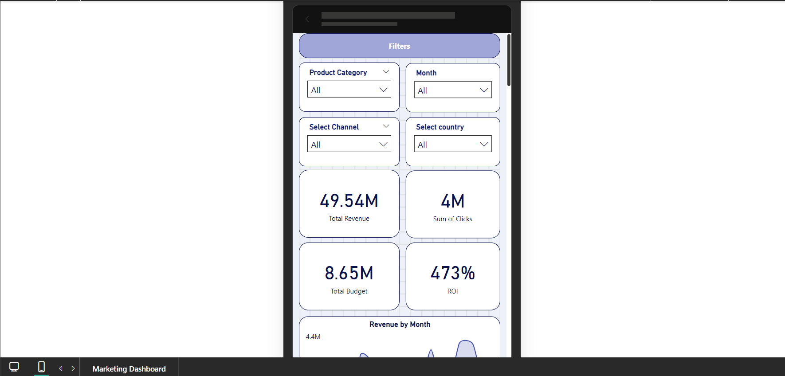
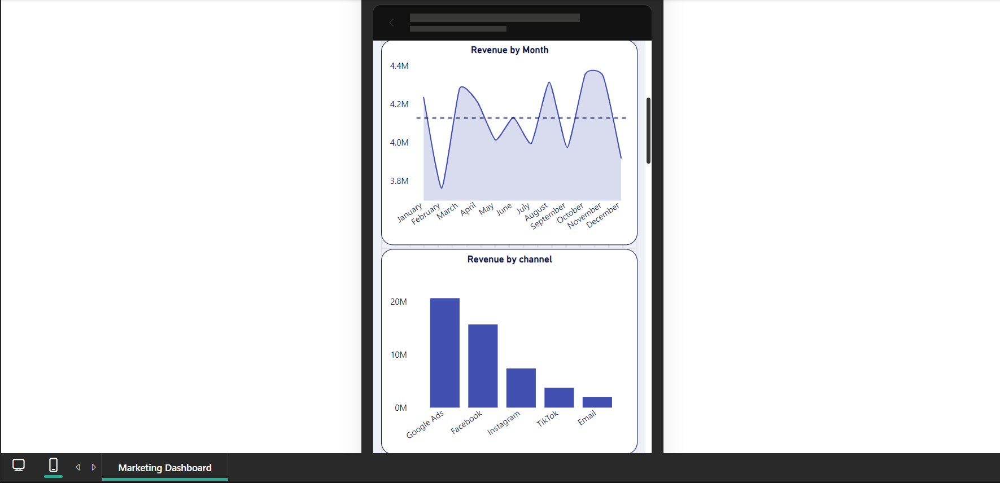

# Marketing Performance Dashboard

### Desktop View

---
### Mobile View

---
## Business Objective

The primary objective was to move away from static reporting to a dynamic, real-time solution for marketing and sales performance. The business required a single, comprehensive view to answer key strategic questions efficiently:

* **ROI Efficiency:** What is the true Return on Investment (ROI) relative to our allocated budget?
* **Channel Effectiveness:** Which specific marketing channels are driving the highest revenue and engagement?
* **Performance Trends:** What are the observed monthly revenue trends, seasonal fluctuations, and areas for improvement?

## Data Source
The dashboard integrates core financial and engagement metrics, covering the full marketing funnel from impressions and clicks to final revenue.

| Data Metric | Description | Key Dimensions |
| :--- | :--- | :--- |
| **Financial** | Total Revenue, Total Budget, ROI % | Time (Monthly), Country, Product Category |
| **Engagement** | Sum of Clicks, Impressions | Marketing Channel (Google Ads, Facebook, etc.) |

##  Tools

* **Microsoft Power BI Desktop** 
* **Power Query**
* **DAX** 

## Data Cleanup

1.  **Data Validation:** Ensured data integrity and resolved inconsistencies in channel naming and date formats.
2.  **Measure Creation:** Developed robust DAX measures, focusing on ratios and aggregations (e.g., the high-level `ROI %`).

## Analysis 
The dashboard is structured to guide the user from a high-level overview to detailed breakdowns:

1.  **KPI Strip:** Provides immediate awareness of the four core metrics: `Sum of Clicks`, `Total Revenue`, `Total Budget`, and `473% ROI`.
2.  **Filters Pane:** A dedicated, clean area on the left allows for dynamic filtering across the five main dimensions, ensuring personalized analysis.
3.  **Revenue Trend:** The "Revenue by Month" line chart effectively visualizes the 12-month performance trajectory.
4.  **Distribution:** Bar and Donut charts break down performance, showing where the absolute revenue comes from (`Revenue by Channel`) versus where the bulk of engagement is focused (`% Clicks by Channel`).

## Results

Analysis of the current data highlights the following performance observations:

* **High Efficiency:** The significant ROI confirms that the current marketing strategy is generating strong returns relative to the invested budget.
* **Channel Dominance:** Google Ads and Facebook are the dominant revenue drivers, while other channels (like TikTok and Email) contribute smaller absolute revenues but are present in the click distribution.
* **Product Visibility:** Specific product categories, such as 'Furniture', show leading impression totals, indicating successful campaign visibility in those segments.

## Recommendations

1.  **Resource Reallocation:** Consider a phased shift of budget allocation towards the highest-performing channels (based on ROI) to maximize return.
2.  **Conversion Optimization:** Investigate why channels with decent click volume (as seen in the donut chart) are not converting into proportional revenue, potentially identifying weaknesses in landing pages or ad copy.
